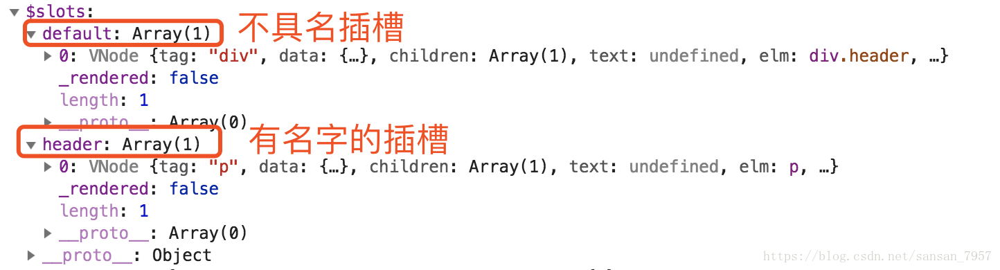

# vue-render

### 安装依赖
```
yarn install
```

### 运行项目
```
yarn run serve
```

@[toc]  

vue渲染函数文档第一遍看的晕晕乎乎的，再看看写写终于清晰了。建议配合[文档](https://cn.vuejs.org/v2/guide/render-function.html)阅读，本文也是根据文档加上自己的理解。

注：本文代码都是在单文件组件中编写。

# render 函数作用

`render 函数` 跟 `template` 一样都是创建 html 模板的，但是有些场景中用 `template` 实现起来代码冗长繁琐而且有大量重复，这时候就可以用 `render 函数`。

官网例子：子组件想要根据父组件传递的 `level` 值（1-6）来决定渲染标签 `h 几`。具体代码可以看文档。

# render 函数讲解

`render 函数`即渲染函数，它是个函数，它的参数也是个函数——即 `createElement`，我们重点来说 `createElement 参数`。

1. ## render 函数的返回值（VNode）

    VNode（即：虚拟节点），也就是我们要渲染的节点。

2. ## render 函数的参数（createElement）

    `createElement ` 是 `render 函数` 的参数，它本身也是个函数，并且有三个参数。

    1. ### createElement 函数的返回值（VNode）

        createElement 函数的返回值是 VNode（即：虚拟节点）。

    2. ### createElement 函数的参数（三个）
    
        1. 一个 HTML 标签字符串，组件选项对象，或者解析上述任何一种的一个 async 异步函数。类型：{String | Object | Function}。**必需**。
        2. 一个包含模板相关属性的数据对象你可以在 template 中使用这些特性。类型：{Object}。可选。
        3. 子虚拟节点 (VNodes)，由 `createElement()` 构建而成，也可以使用字符串来生成“文本虚拟节点”。类型：{String | Array}。可选。
    
    3. ### 结合代码
    
            /**
             * render: 渲染函数
             * 参数: createElement
             * 参数类型: Function
            */
            render: function (createElement) {
              let _this = this['$options'].parent   // 我这个是在 .vue 文件的 components 中写的，这样写才能访问this
              let _header = _this.$slots.header     // $slots: vue中所有分发插槽，不具名的都在default里
            
              /**
               * createElement 本身也是一个函数，它有三个参数
               * 返回值: VNode，即虚拟节点
               * 1. 一个 HTML 标签字符串，组件选项对象，或者解析上述任何一种的一个 async 异步函数。必需参数。{String | Object | Function} - 就是你要渲染的最外层标签
               * 2. 一个包含模板相关属性的数据对象你可以在 template 中使用这些特性。可选参数。{Object} - 1中的标签的属性
               * 3. 子虚拟节点 (VNodes)，由 `createElement()` 构建而成，也可以使用字符串来生成“文本虚拟节点”。可选参数。{String | Array} - 1的子节点，可以用 createElement() 创建，文本节点直接写就可以
               */
              return createElement(       
                // 1. 要渲染的标签名称：第一个参数【必需】      
                'div',   
                // 2. 1中渲染的标签的属性，详情查看文档：第二个参数【可选】
                {
                  style: {
                    color: '#333',
                    border: '1px solid #ccc'
                  }
                },
                // 3. 1中渲染的标签的子元素数组：第三个参数【可选】
                [
                  'text',   // 文本节点直接写就可以
                  _this.$slots.default,  // 所有不具名插槽，是个数组
                  createElement('div', _header)   // createElement()创建的VNodes
                ]
              )
            }

可以看下控制台中打印出来的 `$slots`



